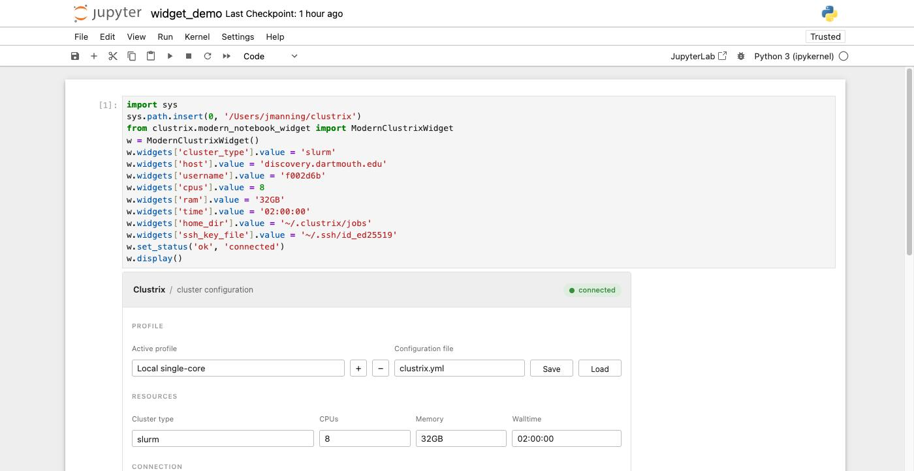
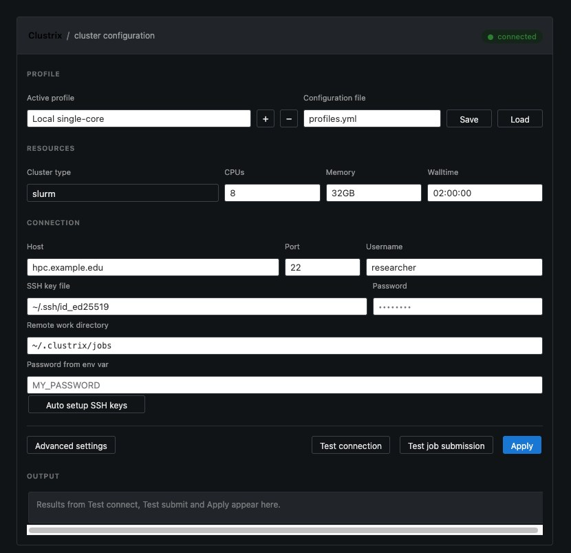

# Clustrix

[](https://github.com/ContextLab/clustrix/actions/workflows/tests.yml)
[](https://github.com/psf/black)
[](https://github.com/PyCQA/flake8)
[](https://mypy-lang.org/)
[](https://pypi.org/project/clustrix/)
[](https://pepy.tech/project/clustrix)
[](https://clustrix.readthedocs.io/en/latest/?badge=latest)
[](https://www.python.org/downloads/)
[](https://opensource.org/licenses/MIT)

Clustrix is a Python package that enables seamless distributed computing on clusters. With a simple decorator, you can execute any Python function remotely on cluster resources while automatically handling dependency management, environment setup, and result collection.

## Features

- **Simple Decorator Interface**: Just add `@cluster` to any function
- **Automated SSH Key Setup**: Create and deploy SSH keys to enable secure passwordless authentication with one click or API call
- **Interactive Jupyter Widget**: `%%remote` magic command with GUI configuration manager
- **Multiple Cluster Backends**: local, SSH, SLURM and HuggingFace Jobs -- every backend Clustrix ships has been run end to end (see [Supported Cluster Types](#supported-cluster-types))
- **Unified Filesystem Utilities**: Work with files seamlessly across local and remote clusters
- **Automatic Dependency Management**: Captures and replicates your exact Python environment
- **Loop Parallelization**: distributes a loop across nodes when its body has no
  dependencies between iterations. The analysis is conservative and declines
  most real loops — see [Limitations](https://clustrix.readthedocs.io/en/latest/limitations.html)
- **Flexible Configuration**: config files, `configure()`, or the interactive
  widget. Note there is no general "override any field from the environment"
  mechanism — only `CLUSTRIX_CONFIG_DIR` and the password variable named by
  `password_env_var`
- **Error Handling**: Comprehensive error reporting and job monitoring

Read [Supported Cluster Types](#supported-cluster-types) before relying on a
backend. Not everything in this package works, and the sections below say which
parts do.

## Quick Start

### Installation

> **⚠️ PyPI is behind this README.** `pip install clustrix` installs **0.1.1**;
> this document describes **0.2.0**. 0.1.1 predates the fixes for two real
> defects: `@cluster` could return a fabricated string instead of your result,
> and remote results were unpickled without authentication (a remote-to-local
> code execution path). Until 0.2.0 is published, install from the repository.

```bash
pip install "git+https://github.com/ContextLab/clustrix.git@master"
```

Check what you actually have:

```bash
python -c "import clustrix; print(clustrix.__version__)"
```

### Basic Configuration

```python
# cluster-required: needs a configured cluster to execute
import clustrix

# Configure your cluster
clustrix.configure(
    cluster_type='slurm',
    cluster_host='your-cluster.example.com',
    username='your-username',
    default_cores=4,
    default_memory='8GB'
)
```

### Using the Decorator

```python
# cluster-required: needs a configured cluster to execute
from clustrix import cluster

@cluster(cores=8, memory='16GB', time='02:00:00')
def expensive_computation(data, iterations=1000):
    import numpy as np
    array = np.asarray(data)
    result = 0
    for i in range(iterations):
        result += np.sum(array ** 2)
    return result

# This function will execute on the cluster
data = [1, 2, 3, 4, 5]
result = expensive_computation(data, iterations=10000)
print(f"Result: {result}")
```

### Jupyter Notebook Integration

Clustrix ships an IPython magic that opens a configuration widget in the
notebook:

```jupyter
%%remote
```

Importing `clustrix` registers the magic but does **not** display the widget --
a library should not inject UI as a side effect of being imported. Run
`%%remote` in a cell when you want the widget, or call
`clustrix.notebook_magic.display_config_widget()`. Setting
`CLUSTRIX_AUTO_WIDGET=1` restores the old display-on-import behaviour.

`%%clusterfy` still works as a deprecated alias and emits a `DeprecationWarning`.

#### Interactive Configuration Widget

The widget edits the same settings as `clustrix.configure()` and applies them to
the current session.



Its colours resolve through JupyterLab's own theme variables, so it follows the
notebook theme instead of carrying a second hand-maintained dark stylesheet:



"Show advanced" reveals package manager, Python executable, environment
variables, module loads and pre-execution commands:


##### What the widget covers

The cluster type dropdown offers `local`, `ssh`, `slurm` and `huggingface` --
the contents of `clustrix.config.SUPPORTED_CLUSTER_TYPES`.

- `ssh` and `slurm` show the connection section: host, port, username, SSH key
  file, password, remote work directory, an environment variable to read the
  password from, and an "Auto setup SSH keys" button.
- `huggingface` shows namespace, flavor, token, and an "Allow paid GPU flavors"
  checkbox. GPU flavors bill by the second, so that box has to be ticked before
  one is accepted.
- `local` needs no connection settings at all.

There are no PBS, SGE, Kubernetes, AWS, GCP, Azure or Lambda Cloud entries, and
no `k8s_*` settings: those backends are not currently supported (see
[Backends that are not currently supported](#backends-that-are-not-currently-supported)).

##### Using the widget

1. **Select a profile**: choose one from the dropdown or add a new one with `+`
2. **Edit settings**: cluster type, resources, connection details
3. **Advanced options**: click "Show advanced" for environment setup
4. **Test**: "Test connection" and "Test job submission" report into the Output
   panel at the bottom of the widget
5. **Apply**: "Apply" calls `configure()` with these settings, so subsequent
   `@cluster` functions use them
6. **Save for later**: "Save" writes the profile to the named configuration file

### Configuration File

Create a `clustrix.yml` file in your project directory:

```yaml
cluster_type: slurm
cluster_host: cluster.example.com
username: myuser
key_file: ~/.ssh/id_rsa

default_cores: 4
default_memory: 8GB
default_time: "01:00:00"
default_partition: gpu

remote_work_dir: /scratch/myuser/clustrix
conda_env_name: myproject

auto_parallel: true
max_parallel_jobs: 50
cleanup_on_success: true

module_loads:
  - python/3.9
  - cuda/11.2

environment_variables:
  CUDA_VISIBLE_DEVICES: "0,1"
```

`remote_work_dir` defaults to `~/.clustrix/jobs`. It must be on a filesystem
the compute node can see: on SLURM each node has its own `/tmp`,
so an environment built on the login node is simply absent at run time and the
job dies with exit 127 before writing any diagnostics. A home directory or a
shared scratch path (as above) both work; `/tmp` does not.

Clustrix reads `config.yml`, `config.yaml` or `config.json` from `~/.clustrix`,
then `clustrix.yml`/`.yaml`/`.json` from the current directory, and stops at the
first one it finds. Setting `CLUSTRIX_CONFIG_DIR` moves the first of those
locations somewhere else, which matters in containers and CI images where
`$HOME` is not writable or not persistent, on machines shared by several
projects, and in tests -- without it, the widget's "Save" button writes into
your real `~/.clustrix` during a test run.

Two timeouts are worth knowing about:

- `ssh_connect_timeout` (default 30 seconds) bounds how long paramiko waits to
  establish a connection. The OS default is minutes, which turns an unreachable
  host into a hang rather than an error.
- `venv_setup_timeout` (default 300 seconds) bounds remote virtualenv creation.

## SSH Key Automation

Clustrix provides automated SSH key setup: it generates a key, deploys it to
the cluster and writes the `~/.ssh/config` entry in one call, instead of doing
those three steps by hand.

### Quick Setup Methods

#### Method 1: Jupyter Widget (Recommended)
Open the widget with the `%%remote` magic:

```jupyter
%%remote
```

1. Choose a remote cluster type (`ssh` or `slurm`) so the connection section
   appears
2. Enter your cluster hostname and username
3. Enter your password
4. Click "Auto setup SSH keys"

#### Method 2: CLI Command
```bash
# Basic setup
clustrix ssh-setup --host cluster.university.edu --user your_username

# With custom alias for easy access
clustrix ssh-setup --host cluster.university.edu --user your_username --alias my_hpc

# Now you can connect with: ssh my_hpc
```

#### Method 3: Python API
```python
# cluster-required: needs a configured cluster to execute
from clustrix import setup_ssh_keys_with_fallback
from clustrix.config import ClusterConfig

config = ClusterConfig(
    cluster_type="slurm",
    cluster_host="cluster.university.edu", 
    username="your_username"
)

result = setup_ssh_keys_with_fallback(config)
if result["success"]:
    print("✅ SSH keys setup successfully!")
```

### Key Features

- **🔒 Secure**: Ed25519 keys with proper permissions (600/644)
- **🧹 Smart Cleanup**: Automatically removes conflicting old keys
- **🔄 Key Rotation**: Force refresh to generate new keys
- **🌐 Cross-platform**: Works on Windows, macOS, Linux  
- **🏢 Enterprise Ready**: Handles Kerberos clusters gracefully
- **💡 Smart Fallbacks**: Environment-specific password retrieval

### Password Fallback System

No need to enter passwords manually! Clustrix automatically retrieves passwords from:

- **Google Colab**: Colab secrets (stored securely)
- **Environment Variables**: `CLUSTRIX_PASSWORD_*` or `CLUSTER_PASSWORD`
- **Interactive Prompts**: GUI popups in notebooks, terminal prompts in CLI

### Enterprise Cluster Support

For university/enterprise clusters using Kerberos authentication:
```bash
# Clustrix deploys keys successfully, then use Kerberos for auth
kinit your_netid@UNIVERSITY.EDU
ssh your_netid@cluster.university.edu
```

**📖 For complete details, try the interactive [SSH Key Automation Tutorial](docs/ssh_key_automation_tutorial.ipynb)** [](https://colab.research.google.com/github/ContextLab/clustrix/blob/master/docs/ssh_key_automation_tutorial.ipynb)

## Advanced Usage

### Unified Filesystem Utilities

Clustrix provides unified filesystem operations that work seamlessly across local and remote clusters:

```python
# cluster-required: needs a configured cluster to execute
from clustrix import cluster_ls, cluster_find, cluster_stat, cluster_exists, cluster_glob
from clustrix.config import ClusterConfig

# Configure for local or remote operations
config = ClusterConfig(
    cluster_type="slurm",  # or "local" for local operations
    cluster_host="cluster.edu",
    username="researcher",
    remote_work_dir="/scratch/project"
)

# List directory contents (works locally and remotely)
files = cluster_ls("data/", config)

# Find files by pattern
csv_files = cluster_find("*.csv", "datasets/", config)

# Check file existence
if cluster_exists("results/output.json", config):
    print("Results already computed!")

# Get file information
file_info = cluster_stat("large_dataset.h5", config)
print(f"Dataset size: {file_info.size / 1e9:.1f} GB")

# Use with @cluster decorator for data-driven workflows
@cluster(cores=8)
def process_datasets(config):
    # Find all data files on the cluster
    data_files = cluster_glob("*.csv", "input/", config)
    
    results = []
    # Runs sequentially on the cluster node -- auto-parallelization needs a
    # literal range() and a function that accepts the chunk keywords.
    for filename in data_files:
        # Check file size before processing
        file_info = cluster_stat(filename, config)
        if file_info.size > 100_000_000:  # Large files
            result = process_large_file(filename, config)
        else:
            result = process_small_file(filename, config)
        results.append(result)
    
    return results
```

**Available filesystem operations:**

- `cluster_ls()` - List directory contents
- `cluster_find()` - Find files by pattern (recursive)
- `cluster_stat()` - Get file information (size, modified time, permissions)
- `cluster_exists()` - Check if file/directory exists
- `cluster_isdir()` / `cluster_isfile()` - Check file type
- `cluster_glob()` - Pattern matching for files
- `cluster_du()` - Directory usage information
- `cluster_count_files()` - Count files matching pattern

### Cost monitoring: removed in v0.2.0

The cost monitoring and cloud pricing API is gone, along with all five of its
public functions -- `cost_tracking_decorator`, `get_cost_monitor`,
`start_cost_monitoring`, `generate_cost_report` and `get_pricing_info`.
Importing any of them now raises `ImportError`. They priced the cloud VM
backends, and those backends were removed too (see
[Backends that are not currently supported](#backends-that-are-not-currently-supported)),
so the API had nothing left to price. Use your provider's own pricing
calculator instead.

### Custom Resource Requirements

```python
# cluster-required: needs a configured cluster to execute
@cluster(
    cores=16,
    memory='32GB',
    time='04:00:00',
    partition='gpu',
    environment='tensorflow-env'
)
def train_model(data, epochs=100):
    # Your machine learning code here
    pass
```

### Manual Parallelization Control

```python
# cluster-required: needs a configured cluster to execute
@cluster(parallel=False)  # Disable automatic loop parallelization
def sequential_computation(data):
    result = []
    for item in data:
        result.append(process_item(item))
    return result

@cluster(parallel=True)   # Enable automatic loop parallelization
def parallel_computation(data):
    results = []
    # Sequential. `data` is not a literal range() and this function takes
    # no chunk keyword, so auto-parallelization declines it.
    for item in data:
        results.append(expensive_operation(item))
    return results
```

### Different Cluster Types

```python
# cluster-required: needs a configured cluster to execute
# SLURM cluster
clustrix.configure(cluster_type='slurm', cluster_host='slurm.example.com')

# Simple SSH execution (no scheduler)
clustrix.configure(cluster_type='ssh', cluster_host='server.example.com')

# HuggingFace Jobs (no host: work is submitted over an HTTP API)
clustrix.configure(cluster_type='huggingface', hf_namespace='my-org')

# Local execution, no cluster needed
clustrix.configure(cluster_type='local')

# Those four are the whole list. Anything else -- 'pbs', 'sge', 'kubernetes'
# -- raises ValueError: Unsupported cluster type. See "Backends that are not
# currently supported" below.
```

### HuggingFace Jobs

`cluster_type="huggingface"` runs each function inside a HuggingFace Job. It
needs no cluster reservation, no VPN and no institutional SSH credentials,
which is why the integration tests use it.

```python
# cluster-required: needs a configured cluster to execute
import clustrix
from clustrix import cluster

clustrix.configure(
    cluster_type='huggingface',
    hf_token='hf_...',        # optional: HF_TOKEN or `hf auth login` also work
    hf_namespace='my-org',    # usually an org, not a personal account
)

@cluster(cores=2)
def where_am_i():
    import platform
    return platform.node(), platform.python_version()

print(where_am_i())
```

How a job is carried out: the function, its arguments and its keyword arguments
are serialized with dill and passed to the container in an environment
variable; the container decodes them, calls the function, and prints the
serialized result between two marker lines; this side reads the job's logs and
decodes what is between them. There is no shared filesystem, so nothing is
uploaded and nothing is left behind.

Configuration:

| Option | Default | Notes |
|-|-|-|
| `hf_namespace` | `hf_username` | The account the job is billed to. Personal accounts are often not on a plan that can run jobs, so this is usually an org. |
| `hf_flavor` | `cpu-basic` | Hardware tier. |
| `hf_image` | `python:<your minor version>-slim` | See below. |
| `hf_job_timeout` | `30m` | Passed to the HF API. |
| `hf_allow_gpu_flavors` | `False` | Must be `True` before any non-`cpu-` flavor is accepted. |

Three things regularly catch people out:

- **The image tracks your local Python.** dill payloads carry CPython bytecode,
  which is not portable across minor versions, so the container image defaults
  to the calling interpreter's version. Overriding `hf_image` with a mismatched
  Python is the single most likely way to get an "unknown opcode" failure.
- **GPU flavors bill by the second.** Any flavor whose name does not start with
  `cpu-` is treated as a GPU tier and rejected unless
  `hf_allow_gpu_flavors=True`. The check is a prefix test rather than a list of
  GPU names, so new HF hardware fails closed rather than being waved through.
- **Payloads are capped at 256 KB** once base64-encoded. Pass large data through
  a Hub dataset and load it inside the function rather than closing over it.

Deserializing a dill payload executes arbitrary code, so results are not
trusted on sight. Each job is given a fresh random key as a job secret; the
container prints an HMAC-SHA256 of the bytes it emitted, and clustrix refuses
to unpickle anything whose tag does not verify. The SSH and scheduler paths
verify their results the same way.

### Backends that are not currently supported

Clustrix once shipped seven more execution backends. All seven were implemented
in full, and not one had ever been shown to run a job end to end against real
hardware. Rather than keep publishing them as if they worked, they were removed
in v0.2.0.

They are planned for a future update. Each has a tracking issue, and the gate
for restoring one is the gate the surviving four already passed: a real job, on
real hardware, whose result comes back and is checked in as evidence. No date is
promised.

| Not supported | Issue | What it was |
|-|-|-|
| PBS | [#140](https://github.com/ContextLab/clustrix/issues/140) | `cluster_type="pbs"` -- the PBS/Torque scheduler |
| SGE | [#141](https://github.com/ContextLab/clustrix/issues/141) | `cluster_type="sge"` -- Sun/Son of Grid Engine |
| Kubernetes | [#142](https://github.com/ContextLab/clustrix/issues/142) | `cluster_type="kubernetes"`, the `k8s_*` settings, cluster auto-provisioning |
| AWS | [#143](https://github.com/ContextLab/clustrix/issues/143) | `provider="aws"` -- EC2 and EKS |
| GCP | [#144](https://github.com/ContextLab/clustrix/issues/144) | `provider="gcp"` -- Google Compute Engine |
| Azure | [#145](https://github.com/ContextLab/clustrix/issues/145) | `provider="azure"` -- Azure VMs |
| Lambda Cloud | [#146](https://github.com/ContextLab/clustrix/issues/146) | `provider="lambda"` -- Lambda Labs GPU cloud |

The HuggingFace **Spaces** provider (`provider="huggingface"`) went with them.
That is a different thing from `cluster_type="huggingface"`, which is
HuggingFace **Jobs** -- verified end to end and fully supported. The cost
monitoring and cloud pricing API was removed too.

**What to do instead.** For a rented GPU without owning hardware, use
`cluster_type="huggingface"`. For a machine you brought up yourself through
your provider's own console or CLI, point `cluster_type="ssh"` at it. For a
batch allocation, `cluster_type="slurm"`. All three are verified end to end.

## Command Line Interface

```bash
# Configure Clustrix
clustrix config --cluster-type slurm --cluster-host cluster.example.com --cores 8

# Check current configuration
clustrix config

# Load configuration from file
clustrix load my-config.yml

# Check cluster status
clustrix status

# Set up SSH keys for a cluster
clustrix ssh-setup --host cluster.example.com --user myuser

# Manage stored credentials
clustrix credentials --help
```

## How It Works

1. **Function Serialization**: Clustrix captures your function, arguments, and dependencies using advanced serialization
2. **Environment Replication**: Creates an identical Python environment on the cluster with all required packages
3. **Job Submission**: Submits your function as a job to the cluster scheduler
4. **Execution**: Runs your function on cluster resources with specified requirements
5. **Result Collection**: Automatically retrieves results once execution completes
6. **Cleanup**: Optionally cleans up temporary files and environments

### Important Notes

**⚠️ REPL/Interactive Python Limitation**: Functions defined interactively in the Python REPL (command line `python` interpreter) lose the *source-based* features — automatic loop parallelization and complexity analysis — because those parse the function's source with `ast` and `inspect.getsource()` cannot recover it.

Serialization itself does **not** need the source. `clustrix.utils.serialize_function` / `deserialize_function` work from the code object and round-trip such a function correctly, so it still runs remotely and returns the right answer. This affects:
- Interactive Python sessions (`python` command)
- Some notebook environments that don't preserve function source

**✅ Recommended Approach**: Define functions in:
- Python files (`.py` scripts)
- Jupyter notebooks 
- IPython environments
- Any environment where `inspect.getsource()` can access the function source code

```pycon
# In the interactive REPL this still runs and returns the right answer, but no
# loop parallelization is applied, because that
# need the source.
>>> @cluster(cores=2)
... def my_function(x):
...     return x * 2
>>> my_function(5)  # -> 10, executed remotely, analysed features skipped
10
```

In a `.py` file or a notebook you get everything, including the source-based
features:

```python
# cluster-required: needs a configured cluster to execute
from clustrix import cluster

@cluster(cores=2)
def my_function(x):
    return x * 2

result = my_function(5)
```

## Supported Cluster Types

| `cluster_type` | Status |
|-|-|
| `slurm` | Verified. A real job ran on a production SLURM cluster and returned its result. |
| `ssh` | Verified. Direct execution over SSH with no scheduler; a real job ran on an 8-GPU host. |
| `huggingface` | Verified. HuggingFace Jobs; a real job ran in a container. |
| `local` | Runs in local processes. Used for development and the fast tests. |

Those four are the whole list -- the contents of
`clustrix.config.SUPPORTED_CLUSTER_TYPES`. PBS, SGE, Kubernetes and the
AWS / GCP / Azure / Lambda Cloud VM backends are **not currently supported**;
see [Backends that are not currently supported](#backends-that-are-not-currently-supported).

The three "Verified" rows are the backends exercised by
`scripts/collect_execution_evidence.py`, which submits a genuine job to each
reachable target, waits for it, and prints what came back. Nothing in it is
mocked, and a target it cannot reach is reported as skipped rather than as
passing:

```bash
python scripts/collect_execution_evidence.py            # all reachable targets
python scripts/collect_execution_evidence.py slurm gpu  # a subset
```

Credentials come from `~/.clustrix-dev-credentials` or from the environment
(`CLUSTRIX_SLURM_PASSWORD`, `CLUSTRIX_GPU_PASSWORD`, `HF_TOKEN`). The transcript
of the last run is in [docs/evidence/execution-evidence.txt](docs/evidence/execution-evidence.txt).

## Repository Structure

The Clustrix repository follows standard Python project organization:

```
clustrix/
├── clustrix/              # Main package source code
│   ├── __init__.py       # Package initialization and public API
│   ├── decorator.py      # @cluster decorator implementation
│   ├── config.py         # Configuration management
│   ├── executor_*.py     # Execution engines (core, connections, schedulers, etc.)
│   ├── filesystem.py     # Cross-cluster filesystem utilities
│   ├── utils.py          # Core utilities and job management
│   ├── cli.py            # Command line interface
│   └── hf_jobs.py        # HuggingFace Jobs backend
├── tests/                # Test suite organized by category
│   ├── unit/            # Fast unit tests (run in CI)
│   ├── integration/     # Provisions REAL billable AWS resources;
│   │                    # refuses to run without CLUSTRIX_ALLOW_BILLABLE=1
│   ├── real_world/      # Tests requiring actual cluster access
│   ├── comprehensive/   # Performance and edge case tests
│   └── infrastructure/  # Test infrastructure setup
├── docs/                # Documentation and tutorials
│   ├── source/          # Sphinx documentation source
│   │   └── notebooks/   # Tutorial notebooks
│   └── *.md             # Various documentation files
├── scripts/             # Utility scripts for development
│   ├── check_quality.py               # Code quality validation
│   ├── pre_push_check.py              # Pre-push validation script
│   ├── run_real_world_tests.py        # Real world test runner
│   └── collect_execution_evidence.py  # Real job on every reachable backend
└── .github/             # CI/CD configuration
    ├── workflows/       # GitHub Actions workflows
    └── ISSUE_TEMPLATE/  # Issue templates
```

### Development Workflow

- **Testing**: Use `pytest tests/unit/` for development testing.
  `tests/integration/` provisions real, billable AWS resources and is
  refused unless `CLUSTRIX_ALLOW_BILLABLE=1` is set deliberately (#109).
- **Quality Checks**: Run `python scripts/check_quality.py` before committing
- **Real World Tests**: Use `python scripts/run_real_world_tests.py` when credentials available
- **Documentation**: Build with `cd docs && make html`

## Dependencies

Clustrix automatically handles dependency management by:

- Capturing your current Python environment by reading installed package
  metadata directly (`importlib.metadata`), not by shelling out to `pip freeze`
  -- the freeze output renders conda-built packages as unusable local paths,
  which silently dropped a third of the environment
- Creating virtual environments on cluster nodes
- Installing exact package versions to match your local environment
- Supporting conda environments for complex scientific software stacks

## Error Handling and Monitoring

```python
# cluster-required: needs a real submitted job to monitor
import clustrix
from clustrix import ClusterExecutor

executor = ClusterExecutor(clustrix.get_config())

# job_id is what submit_job() returned for a job you actually submitted.
status = executor.get_job_status(job_id)

# Cancel it if needed.
executor.cancel_job(job_id)
```

Results are HMAC-verified before they are deserialized, so a job whose result
cannot be authenticated raises rather than returning a value -- see
[the execution model](https://clustrix.readthedocs.io/en/latest/execution_model.html).

## Examples

### Machine Learning Training

```python
# cluster-required: needs a configured cluster to execute
@cluster(cores=8, memory='32GB', time='12:00:00', partition='gpu')
def train_neural_network(training_data, model_config):
    import tensorflow as tf
    
    model = tf.keras.Sequential([
        tf.keras.layers.Dense(128, activation='relu'),
        tf.keras.layers.Dense(10, activation='softmax')
    ])
    
    model.compile(optimizer='adam', loss='sparse_categorical_crossentropy')
    model.fit(training_data, epochs=model_config['epochs'])
    
    return model.get_weights()

# Execute training on cluster
weights = train_neural_network(my_data, {'epochs': 50})
```

### Scientific Computing

```python
# cluster-required: needs a configured cluster to execute
@cluster(cores=16, memory='64GB')
def monte_carlo_simulation(n_samples=1000000):
    import numpy as np
    
    # NOTE: this loop is NOT auto-parallelized. range(n_samples) is not a
    # literal range, and this function does not accept the chunk keywords,
    # so clustrix runs it whole on one node. That is still useful -- the
    # node has 16 cores and 64GB -- but the parallelism is yours to write.
    results = []
    for i in range(n_samples):
        x, y = np.random.random(2)
        if x*x + y*y <= 1:
            results.append(1)
        else:
            results.append(0)
    
    pi_estimate = 4 * sum(results) / len(results)
    return pi_estimate

pi_value = monte_carlo_simulation(10000000)
```

### Data Processing Pipeline

```python
# cluster-required: needs a configured cluster to execute
@cluster(cores=8, memory='16GB')
def process_large_dataset(file_path, chunk_size=10000):
    import pandas as pd
    
    results = []
    for chunk in pd.read_csv(file_path, chunksize=chunk_size):
        # Process each chunk
        processed = chunk.groupby('category').sum()
        results.append(processed)
    
    return pd.concat(results)

# Process data on cluster
processed_data = process_large_dataset('/path/to/large_file.csv')
```

## Testing Philosophy

The goal is that anything claimed to work has been run for real, against real
infrastructure, and that the transcript is reproducible by someone else in one
command. `scripts/collect_execution_evidence.py` is that command, and
`docs/evidence/execution-evidence.txt` is its output.

The existing test suite does not meet that goal yet. It is being worked
towards, and the README should not be read as saying it has been reached:

- 42 of 215 test modules (20%) still use `unittest.mock`. (Count: files
  named `test_*.py` under `tests/`, via
  `find tests -name "test_*.py" | wc -l` and
  `grep -lE "unittest\.mock|Mock\(|MagicMock\(|@patch" $(find tests -name "test_*.py") | wc -l`.)
  Migrating them is in progress; the claim that this project uses zero
  mocks was not true.
- The main CI workflow runs `tests/unit/` plus a local-only slice of the
  integration tests. The SSH, scheduler and cloud tests need credentials CI
  does not have.
- No trustworthy coverage figure has been measured. Several conflicting numbers
  exist in old artifacts; none of them is reproducible, which is why this README
  no longer carries a coverage badge.

### Running Tests

```bash
# Fast unit tests (what CI runs)
pytest tests/unit/ -q

# Everything except tests needing real cluster access
pytest tests/ -m "not real_world"

# A real job on every reachable backend, nothing mocked
python scripts/collect_execution_evidence.py

# Comprehensive real-world tests (requires infrastructure)
python tests/run_real_world_tests.py

# Setup local test infrastructure (Docker-based)
python tests/infrastructure/setup_test_infrastructure.py setup

# Run specific test categories
pytest tests/comprehensive/test_edge_cases_real.py
pytest tests/comprehensive/test_performance_benchmarks_real.py
pytest tests/comprehensive/test_failure_recovery_real.py
```

### Test Infrastructure

Clustrix provides Docker-based local test infrastructure for cost-free testing:

- **SSH Server**: OpenSSH test server on port 2222
- **SLURM Mock**: Simulated SLURM scheduler
- **MinIO**: S3-compatible object storage
- **PostgreSQL**: Database for state management
- **Redis**: Cache and message queue

### Test Categories

1. **Unit Tests**: Core functionality with local execution
2. **Integration Tests**: Multi-component interactions with real services
3. **Edge Cases**: Boundary conditions and unusual scenarios
4. **Performance**: Latency, throughput, and scalability benchmarks
5. **Failure Recovery**: Error handling and resilience testing

## Code Quality

Clustrix maintains high code quality standards:

- **Code Style**: Enforced with Black formatter
- **Linting**: Checked with flake8
- **Type Checking**: Validated with mypy
- **CI/CD**: GitHub Actions for automated testing

To check code quality locally:

```bash
# Run comprehensive quality check (auto-retries until clean)
python scripts/pre_push_check.py

# Run individual checks
pytest --cov=clustrix --cov-report=term
black clustrix/
flake8 clustrix/
mypy clustrix/
```

### Pre-commit Hooks

Pre-commit hooks automatically run quality checks before each commit:

```bash
# Install pre-commit hooks
pre-commit install

# Manual run
pre-commit run --all-files
```

## Additional Documentation

For more detailed information on specific topics, see the organized documentation in the `docs/` directory:

### AWS operator tooling

Clustrix has no AWS *execution* backend -- see
[Backends that are not currently supported](#backends-that-are-not-currently-supported).
`scripts/aws/` is separate: cleanup and teardown utilities for AWS resources
tagged `clustrix:managed=true`, kept so that anything left behind by the
removed provisioning code can still be reclaimed. The IAM guides below are
historical records of the permissions that tooling needed.

- **[AWS Setup Guide](docs/aws/AWS_PERMISSIONS_SETUP_GUIDE.md)** - AWS permissions configuration
- **[AWS Console Quick Steps](docs/aws/AWS_CONSOLE_QUICK_STEPS.md)** - Fast AWS setup guide
- **[AWS EKS Policy Setup](docs/aws/ADD_CUSTOM_EKS_POLICY.md)** - EKS-specific policy configuration
- **[AWS EKS Troubleshooting](docs/aws/AWS_EKS_TROUBLESHOOTING.md)** - Common AWS access issues

### GPU Computing
- **[GPU Detection Fix](docs/gpu/GPU_DETECTION_FIX.md)** - GPU detection troubleshooting

### Technical Design
- **[Function Dependency Design](docs/design/function_dependency_design.md)** - Function dependency resolution architecture
- **[Complexity Threshold Analysis](docs/design/COMPLEXITY_THRESHOLD_ANALYSIS.md)** - Function complexity analysis and optimization

### Complete Documentation
- **[Full Documentation](https://clustrix.readthedocs.io)** - Complete API reference and tutorials
- **[SSH Setup Tutorial](docs/ssh_key_automation_tutorial.ipynb)** - Interactive SSH key automation guide

## Contributing

We welcome contributions! Please see our [Contributing Guide](CONTRIBUTING.md) for details.

## License

Clustrix is released under the MIT License. See [LICENSE](LICENSE) for details.

## Support

- Documentation: [https://clustrix.readthedocs.io](https://clustrix.readthedocs.io)
- Issues: [https://github.com/ContextLab/clustrix/issues](https://github.com/ContextLab/clustrix/issues)
