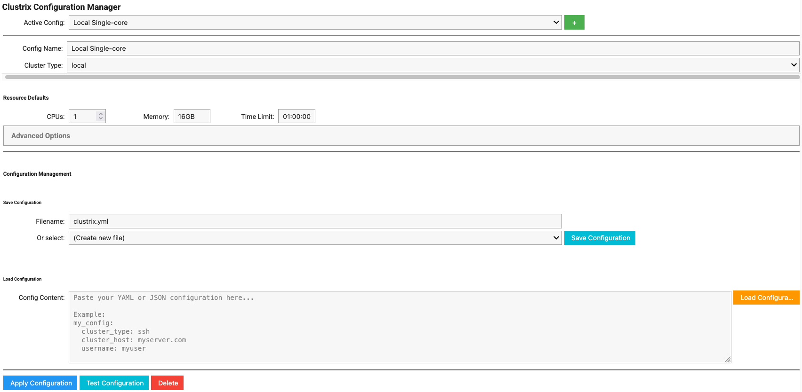
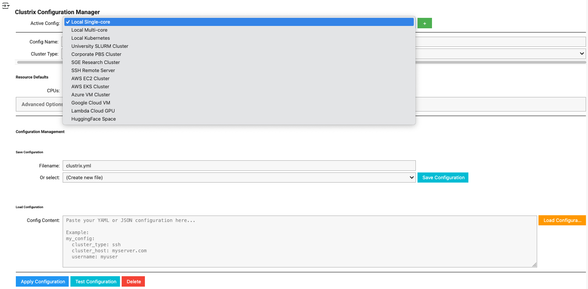
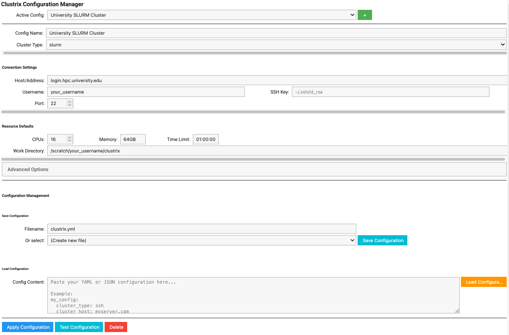
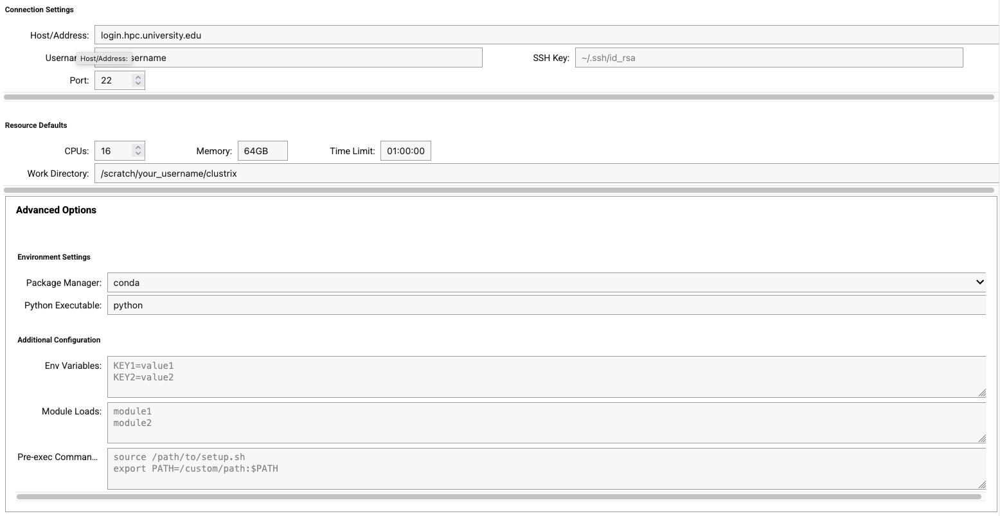
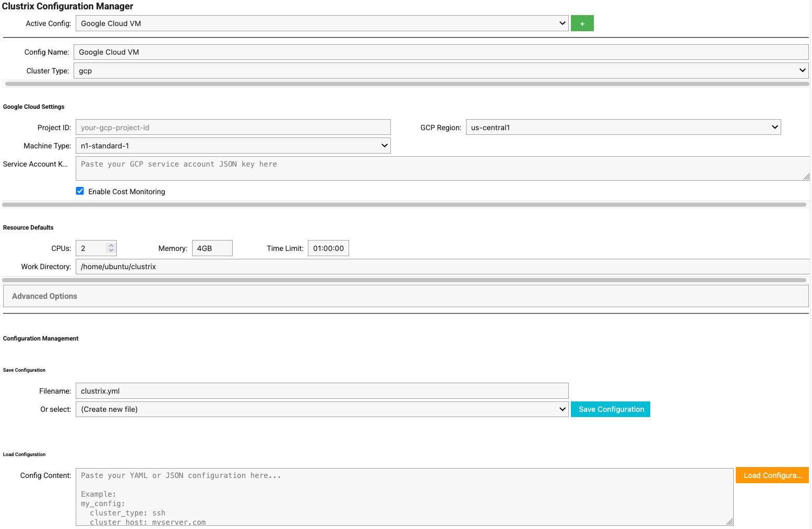
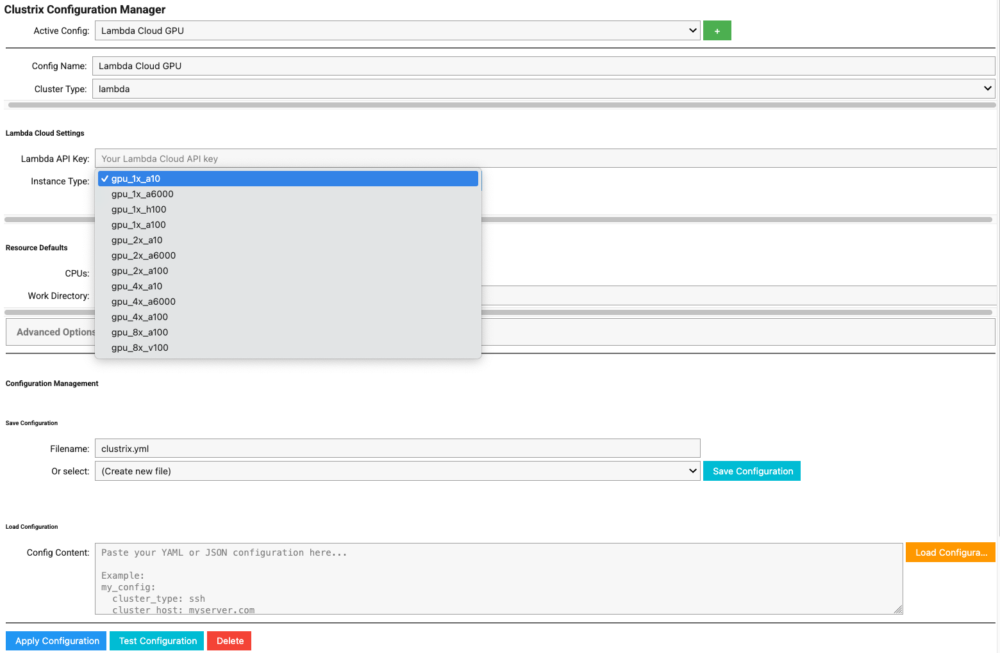

Clustrix Documentation
======================

Clustrix is a Python package that enables seamless distributed computing on clusters. With a simple decorator, you can execute any Python function remotely on cluster resources while automatically handling dependency management, environment setup, and result collection.

.. image:: https://img.shields.io/pypi/v/clustrix.svg
   :target: https://pypi.org/project/clustrix/
   :alt: PyPI version

.. image:: https://img.shields.io/pypi/pyversions/clustrix.svg
   :target: https://pypi.org/project/clustrix/
   :alt: Python versions

.. image:: https://img.shields.io/github/license/ContextLab/clustrix.svg
   :target: https://github.com/ContextLab/clustrix/blob/master/LICENSE
   :alt: License

Features
--------

- **Simple Decorator Interface**: Just add ``@cluster`` to any function
- **Interactive Jupyter Widget**: ``%%clusterfy`` magic command with GUI configuration manager
- **Multiple Cluster Support**: SLURM, PBS, SGE, Kubernetes, and SSH  
- **Native Cost Monitoring**: Built-in cost tracking for AWS, GCP, Azure, and Lambda Cloud
- **Automatic Dependency Management**: Captures and replicates your exact Python environment  
- **Loop Parallelization**: Automatically distributes loops across cluster nodes
- **Local Parallelization**: Multi-core execution for development and testing
- **Flexible Configuration**: Easy setup with config files, environment variables, or interactive widget
- **Error Handling**: Comprehensive error reporting and job monitoring

Quick Start
-----------

Installation
~~~~~~~~~~~~

.. code-block:: bash

   pip install clustrix

Basic Usage
~~~~~~~~~~~

.. code-block:: python

   import clustrix
   
   # Configure your cluster
   clustrix.configure(
       cluster_type='slurm',
       cluster_host='your-cluster.example.com',
       username='your-username',
       default_cores=4,
       default_memory='8GB'
   )
   
   # Decorate your function
   @clustrix.cluster(cores=8, memory='16GB', time='02:00:00')
   def expensive_computation(data, iterations=1000):
       import numpy as np
       result = 0
       for i in range(iterations):
           result += np.sum(data ** 2)
       return result
   
   # Execute on cluster
   data = [1, 2, 3, 4, 5]
   result = expensive_computation(data, iterations=10000)
   print(f"Result: {result}")

Jupyter Notebook Integration
~~~~~~~~~~~~~~~~~~~~~~~~~~~~

For Jupyter notebook users, Clustrix provides an interactive configuration widget:

.. code-block:: python

   import clustrix  # Auto-loads the magic command and displays widget

.. code-block:: jupyter

   %%clusterfy
   # Interactive widget appears with:
   # - Dropdown to select configurations  
   # - Forms to create/edit cluster setups
   # - One-click configuration application
   # - Save/load configurations to files

Interactive Configuration Widget
~~~~~~~~~~~~~~~~~~~~~~~~~~~~~~~~

The Clustrix widget provides a comprehensive GUI for managing cluster configurations directly in Jupyter notebooks.

**Default View**

When you first import clustrix or use the ``%%clusterfy`` magic command, the widget displays with a default "Local Single-core" configuration:

**Configuration Templates**

The dropdown menu includes pre-built templates for various cluster types and cloud providers:

**HPC Cluster Configuration**

For traditional HPC clusters like SLURM, the widget provides all essential configuration fields:

The advanced settings accordion reveals additional options for modules, environment variables, and custom commands:

**Cloud Provider Support**

Cloud providers have dynamic field visibility showing only relevant options:

*Google Cloud Platform:*

*Lambda Cloud GPU Instances:*

The widget includes templates for AWS, Google Cloud, Azure, SLURM, Kubernetes, Lambda Cloud, and HuggingFace Spaces.

Table of Contents
-----------------

.. toctree::
   :maxdepth: 2
   :caption: User Guide

   installation
   quickstart
   configuration
   ssh_setup
   examples
   local_parallel

.. toctree::
   :maxdepth: 2
   :caption: Tutorials
   
   tutorials/slurm_tutorial
   tutorials/pbs_tutorial
   tutorials/kubernetes_tutorial
   tutorials/basic_usage
   tutorials/machine_learning
   tutorials/scientific_computing

.. toctree::
   :maxdepth: 2
   :caption: Interactive Notebooks
   
   notebooks/cluster_config_example
   notebooks/complete_api_demo
   notebooks/slurm_tutorial
   notebooks/pbs_tutorial
   notebooks/sge_tutorial
   notebooks/kubernetes_tutorial
   notebooks/ssh_tutorial
   notebooks/basic_usage

.. toctree::
   :maxdepth: 2
   :caption: Cloud Platform Tutorials
   
   notebooks/aws_cloud_tutorial
   notebooks/azure_cloud_tutorial
   notebooks/gcp_cloud_tutorial
   notebooks/huggingface_spaces_tutorial
   notebooks/lambda_cloud_tutorial
   notebooks/cost_monitoring_tutorial

.. toctree::
   :maxdepth: 2
   :caption: API Reference

   api/decorator
   api/config
   api/notebook_magic
   api/cost_monitoring
   api/executor
   api/local_executor
   api/loop_analysis
   api/utils
   api/cli

.. toctree::
   :maxdepth: 1
   :caption: Development

   contributing
   changelog

Supported Cluster Types
-----------------------

**Traditional HPC Schedulers**

+----------------+------------------+----------------------------------+
| Cluster Type   | Status           | Notes                            |
+================+==================+==================================+
| **SLURM**      | ✅ Full Support  | Production ready                 |
+----------------+------------------+----------------------------------+
| **PBS/Torque** | ✅ Full Support  | Production ready                 |
+----------------+------------------+----------------------------------+
| **SGE**        | ⚡ Nearly Ready  | Job submit works, status pending |
+----------------+------------------+----------------------------------+
| **SSH**        | ✅ Full Support  | Direct execution                 |
+----------------+------------------+----------------------------------+

**Container Orchestration**

+----------------+------------------+----------------------------------+
| Platform       | Status           | Notes                            |
+================+==================+==================================+
| **Kubernetes** | ✅ Full Support  | Native K8s API with auto-deps    |
+----------------+------------------+----------------------------------+
| **AWS EKS**    | ✅ Full Support  | Kubernetes + AWS integration     |
+----------------+------------------+----------------------------------+
| **Azure AKS**  | ✅ Full Support  | Kubernetes + Azure integration   |
+----------------+------------------+----------------------------------+
| **Google GKE** | ✅ Full Support  | Kubernetes + GCP integration     |
+----------------+------------------+----------------------------------+

**Cloud Computing Platforms**

+------------------+------------------+----------------------------------+
| Platform         | Status           | Notes                            |
+==================+==================+==================================+
| **AWS EC2**      | ✅ Full Support  | Auto-provisioning + cost monitor |
+------------------+------------------+----------------------------------+
| **Azure VMs**    | ✅ Full Support  | Auto-provisioning + cost monitor |
+------------------+------------------+----------------------------------+
| **Google Cloud** | ✅ Full Support  | Auto-provisioning + cost monitor |
+------------------+------------------+----------------------------------+
| **Lambda Cloud** | ✅ Full Support  | GPU-optimized instances          |
+------------------+------------------+----------------------------------+
| **HF Spaces**    | ✅ Full Support  | Hugging Face Spaces integration  |
+------------------+------------------+----------------------------------+

Links
-----

* **GitHub Repository**: https://github.com/ContextLab/clustrix
* **PyPI Package**: https://pypi.org/project/clustrix/
* **Issue Tracker**: https://github.com/ContextLab/clustrix/issues
* **Discussions**: https://github.com/ContextLab/clustrix/discussions

Indices and tables
==================

* :ref:`genindex`
* :ref:`modindex`
* :ref:`search`