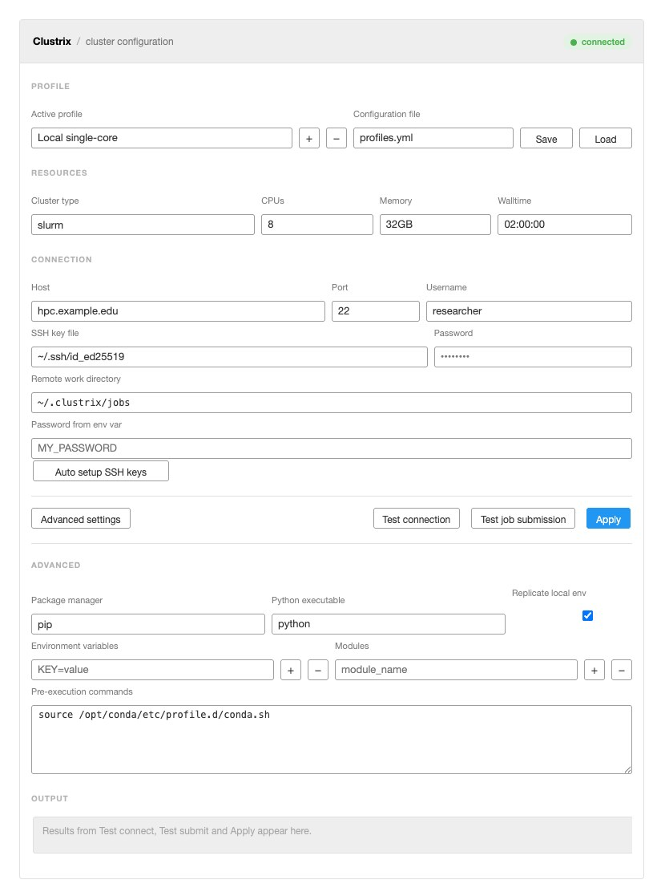

Clustrix Documentation
======================

Clustrix is a Python package that enables seamless distributed computing on clusters. With a simple decorator, you can execute any Python function remotely on cluster resources while automatically handling dependency management, environment setup, and result collection.

.. image:: https://img.shields.io/pypi/v/clustrix.svg
   :target: https://pypi.org/project/clustrix/
   :alt: PyPI version

.. image:: https://img.shields.io/pypi/pyversions/clustrix.svg
   :target: https://pypi.org/project/clustrix/
   :alt: Python versions

.. image:: https://img.shields.io/github/license/ContextLab/clustrix.svg
   :target: https://github.com/ContextLab/clustrix/blob/master/LICENSE
   :alt: License

Features
--------

- **Simple Decorator Interface**: Just add ``@cluster`` to any function
- **Advanced Function Packaging**: AST-based dependency analysis replaces pickle limitations
- **Interactive Jupyter Widget**: ``%%remote`` magic command with GUI configuration manager
- **Multiple Cluster Backends**: SLURM, SSH and HuggingFace Jobs are verified working;
  PBS, SGE and Kubernetes are implemented but untested. See
  :ref:`supported-cluster-types` before relying on a backend.
- **Unified Filesystem Utilities**: Work with files seamlessly across local and remote clusters
- **Shared Storage Optimization**: Automatic detection and optimization for HPC shared filesystems
- **Cost Estimation**: Pricing and cost estimates for AWS, GCP, Azure, and Lambda Cloud
- **Automatic Dependency Management**: Captures and replicates your exact Python environment  
- **Loop Parallelization**: Automatically distributes loops across cluster nodes
- **Local Parallelization**: Multi-core execution for development and testing
- **Flexible Configuration**: Easy setup with config files, environment variables, or interactive widget
- **Error Handling**: Comprehensive error reporting and job monitoring

Quick Start
-----------

Installation
~~~~~~~~~~~~

.. code-block:: bash

   pip install clustrix

Basic Usage
~~~~~~~~~~~

.. code-block:: python

   import clustrix
   
   # Configure your cluster
   clustrix.configure(
       cluster_type='slurm',
       cluster_host='your-cluster.example.com',
       username='your-username',
       default_cores=4,
       default_memory='8GB'
   )
   
   # Decorate your function
   @clustrix.cluster(cores=8, memory='16GB', time='02:00:00')
   def expensive_computation(data, iterations=1000):
       import numpy as np
       array = np.asarray(data)
       result = 0
       for i in range(iterations):
           result += np.sum(array ** 2)
       return result
   
   # Execute on cluster
   data = [1, 2, 3, 4, 5]
   result = expensive_computation(data, iterations=10000)
   print(f"Result: {result}")

Jupyter Notebook Integration
~~~~~~~~~~~~~~~~~~~~~~~~~~~~

Clustrix registers an IPython magic that opens a configuration widget:

.. code-block:: ipython3

   %%remote

Importing ``clustrix`` registers the magic but does **not** display the widget.
A library should not inject UI as a side effect of being imported, so the
widget is shown on demand: run ``%%remote`` in a cell, or call
``clustrix.notebook_magic.display_config_widget()``. Setting
``CLUSTRIX_AUTO_WIDGET=1`` restores the old display-on-import behaviour.

``%%clusterfy`` still works as a deprecated alias and emits a
``DeprecationWarning``.

Interactive Configuration Widget
~~~~~~~~~~~~~~~~~~~~~~~~~~~~~~~~

The widget edits the same settings as ``clustrix.configure()`` and applies them
to the current session.

.. image:: _static/widget/02-after-light.jpg
   :alt: Clustrix widget in JupyterLab, light theme
   :width: 700px

Its colours resolve through JupyterLab's own theme variables, so it follows the
notebook theme rather than carrying a second hand-maintained dark stylesheet:

.. image:: _static/widget/03-after-dark.jpg
   :alt: The same widget in JupyterLab's dark theme
   :width: 700px

"Show advanced" reveals the package manager, Python executable, environment
variables, module loads and pre-execution commands:

**What the widget covers**

The cluster type dropdown offers ``local``, ``ssh``, ``slurm``, ``pbs``,
``sge``, ``kubernetes`` and ``huggingface``.

- ``ssh``, ``slurm``, ``pbs`` and ``sge`` show the connection section: host,
  port, username, SSH key file, password, remote work directory, an environment
  variable to read the password from, and an "Auto setup SSH keys" button.
- ``huggingface`` shows namespace, flavor, token and an "Allow paid GPU
  flavors" checkbox. GPU flavors bill by the second, so that box has to be
  ticked before one is accepted.
- ``kubernetes`` shows **no** dedicated fields. The ``k8s_*`` settings can only
  be set from a configuration file or ``clustrix.configure()``.

There are no AWS, GCP, Azure or Lambda Cloud entries, because those execution
backends are unverified.

Table of Contents
-----------------

.. toctree::
   :maxdepth: 2
   :caption: User Guide

   installation
   ssh_setup

.. toctree::
   :maxdepth: 2
   :caption: Tutorials
   
   tutorials/filesystem_tutorial
   tutorials/slurm_tutorial
   tutorials/pbs_tutorial
   tutorials/kubernetes_tutorial

.. toctree::
   :maxdepth: 2
   :caption: Interactive Notebooks
   
   notebooks/filesystem_tutorial
   notebooks/cluster_config_example
   notebooks/complete_api_demo
   notebooks/slurm_tutorial
   notebooks/pbs_tutorial
   notebooks/sge_tutorial
   notebooks/kubernetes_tutorial
   notebooks/ssh_tutorial
   notebooks/basic_usage

.. warning::

   The cloud VM tutorials below (AWS, Azure, GCP, HuggingFace Spaces, Lambda
   Cloud) describe an execution path that has never been shown to run a job end
   to end. See :ref:`supported-cluster-types`. The cost monitoring tutorial is
   unaffected.

.. toctree::
   :maxdepth: 2
   :caption: Cloud Platform Tutorials
   
   notebooks/aws_cloud_tutorial
   notebooks/azure_cloud_tutorial
   notebooks/gcp_cloud_tutorial
   notebooks/huggingface_spaces_tutorial
   notebooks/lambda_cloud_tutorial
   notebooks/cost_monitoring_tutorial

.. toctree::
   :maxdepth: 2
   :caption: API Reference

   api/decorator
   api/filesystem
   api/dependency_analysis
   api/file_packaging
   api/config
   api/notebook_magic
   api/cost_monitoring
   api/local_executor

.. _supported-cluster-types:

Supported Cluster Types
-----------------------

**Execution backends**

+--------------------+-------------------+--------------------------------------------------+
| ``cluster_type``   | Status            | Notes                                            |
+====================+===================+==================================================+
| ``slurm``          | Verified          | A real job ran on ``discovery.dartmouth.edu``    |
|                    |                   | and returned its result.                         |
+--------------------+-------------------+--------------------------------------------------+
| ``ssh``            | Verified          | Direct execution, no scheduler. A real job ran   |
|                    |                   | on an 8-GPU host.                                |
+--------------------+-------------------+--------------------------------------------------+
| ``huggingface``    | Verified          | HuggingFace Jobs. A real job ran in a container. |
+--------------------+-------------------+--------------------------------------------------+
| ``local``          | Works             | Local processes; used for development and the    |
|                    |                   | fast tests.                                      |
+--------------------+-------------------+--------------------------------------------------+
| ``pbs``            | Untested          | Implemented, but does not use the two-venv path  |
|                    |                   | and has not been run against real hardware.      |
+--------------------+-------------------+--------------------------------------------------+
| ``sge``            | Untested          | Same caveat as PBS.                              |
+--------------------+-------------------+--------------------------------------------------+
| ``kubernetes``     | Untested          | Not verified against a real cluster. Per-job     |
|                    |                   | overrides are unsupported -- the executor reads  |
|                    |                   | only configuration-level ``k8s_*`` settings --   |
|                    |                   | The widget has a Kubernetes section.             |
+--------------------+-------------------+--------------------------------------------------+

**Cloud VM backends**

The ``provider=`` argument to ``@cluster`` (``'aws'``, ``'gcp'``, ``'azure'``,
``'lambda'``, ``'huggingface'``) routes to the AWS EC2, Azure VM, Google
Compute Engine and Lambda Cloud backends. **None of them has been shown to run
a job end to end.** Until recently the path could not have run at all: the
serializer writes the function under a ``"function"`` key while the remote
bootstrap read ``"func"``, so every cloud job died with a ``KeyError`` on its
first line. That was fixed (issue #119), but nothing has since demonstrated a
completed cloud job, and ``scripts/collect_execution_evidence.py`` does not
cover these backends. Treat the cloud platform tutorials listed above as a
description of the intended interface.

Note that ``cluster_type='huggingface'`` (HuggingFace Jobs) is a different
thing from ``provider='huggingface'`` (the HuggingFace Spaces provider, which
never satisfied the dispatch interface). Use the former.

The pricing and cost-estimation clients for AWS, GCP, Azure and Lambda Cloud
are separate code and do work; they query provider pricing APIs and never
submit a job. See :doc:`api/cost_monitoring`.

**Evidence**

The three "Verified" rows are the backends exercised by
``scripts/collect_execution_evidence.py``, which submits a genuine job to each
reachable target, waits for it, and prints what came back. Nothing in it is
mocked, and a target it cannot reach is reported as skipped rather than as
passing:

.. code-block:: bash

   python scripts/collect_execution_evidence.py            # all reachable targets
   python scripts/collect_execution_evidence.py slurm gpu  # a subset

Credentials come from ``~/.clustrix-dev-credentials`` or from the environment
(``CLUSTRIX_SLURM_PASSWORD``, ``CLUSTRIX_GPU_PASSWORD``, ``HF_TOKEN``).

Links
-----

* **GitHub Repository**: https://github.com/ContextLab/clustrix
* **PyPI Package**: https://pypi.org/project/clustrix/
* **Issue Tracker**: https://github.com/ContextLab/clustrix/issues
* **Discussions**: https://github.com/ContextLab/clustrix/discussions

Indices and tables
==================

* :ref:`genindex`
* :ref:`modindex`
* :ref:`search`