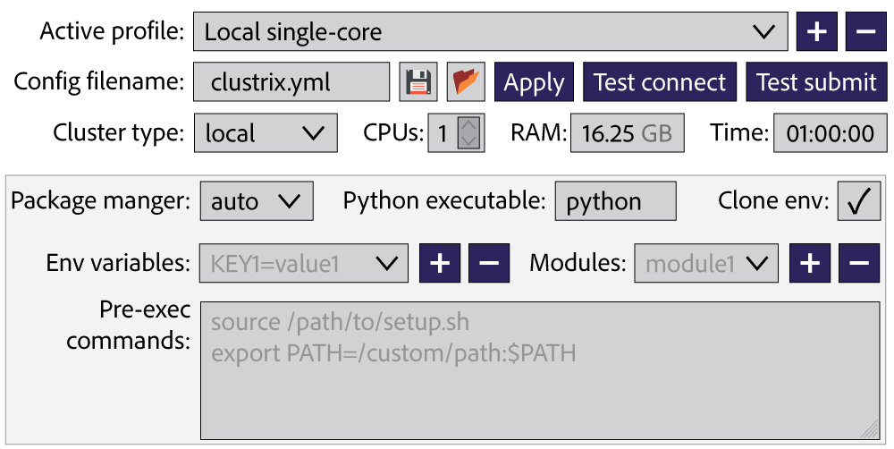
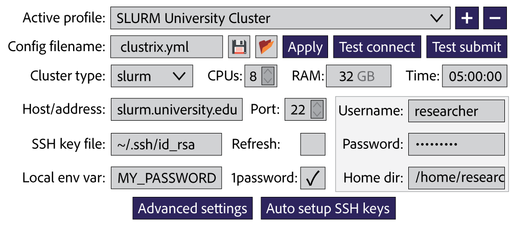

# Widget GUI Redesign Technical Specification

## Overview

This document outlines the redesign of the Clustrix notebook widget based on user mockups. The new design represents a significant shift from the current authentication-focused widget to a comprehensive cluster configuration interface with a clean, modern UI.

## Current vs. Proposed Design

### Current Widget (Enhanced Authentication)
- Authentication-focused design with separate sections
- Vertical layout with expandable sections
- Technical field labels and terminology
- Limited visual hierarchy
- Focus on SSH key setup and authentication methods

### Proposed Widget (Comprehensive Configuration)
- Profile-based configuration management
- Horizontal layout with logical groupings
- User-friendly labels and modern UI elements
- Clear visual hierarchy with consistent styling
- Integrated authentication within cluster setup workflow

## Design Analysis from Mockups

### 1. **Local Basic Configuration** (`clustrix_mockup_local_basic.png`)


**Layout Structure:**
```
[Active profile: Local single-core ▼] [+] [-]
[Config filename: clustrix.yml] [💾] [📝] [Apply] [Test connect] [Test submit]
[Cluster type: local ▼] [CPUs: 1 🔒] [RAM: 16.25 GB] [Time: 01:00:00]
                                    [Advanced settings]
```

**Key Features:**
- **Profile Management**: Dropdown for switching between configurations
- **Quick Actions**: Apply, Test connect, Test submit buttons
- **Resource Configuration**: CPUs, RAM, Time limits with appropriate controls
- **Advanced Settings Toggle**: Expandable section for additional options

### 2. **Local Advanced Configuration** (`clustrix_mockup_local_advanced.png`)



**Additional Elements:**
```
[Package manager: auto ▼] [Python executable: python] [Clone env: ✓]
[Env variables: KEY1=value1 ▼] [+] [-] [Modules: module1 ▼] [+] [-]
[Pre-exec commands: (text area)]
```

**Key Features:**
- **Environment Management**: Package manager, Python path, environment cloning
- **Dynamic Lists**: Environment variables and modules with add/remove buttons
- **Pre-execution Commands**: Multi-line text area for setup scripts
- **Consistent Visual Design**: Same styling as basic layout

### 3. **Remote Basic Configuration** (`clustrix_mockup_remote_basic.png`)



**Remote-Specific Elements:**
```
[Host/address: slurm.university.edu] [Port: 22 🔒] [Username: researcher]
[SSH key file: ~/.ssh/id_rsa] [Refresh: □] [Password: ••••••••]
[Local env var: MY_PASSWORD] [1password: ✓] [Home dir: /home/research]
                            [Advanced settings] [Auto setup SSH keys]
```

**Key Features:**
- **Connection Details**: Host, port, username fields
- **Authentication Options**: SSH keys, password, 1Password, environment variables
- **Smart Defaults**: Pre-populated fields based on cluster type
- **SSH Setup Integration**: Auto setup button for key deployment

## Detailed Component Specifications

### **Top Row: Profile and Configuration Management**

#### **Active Profile Dropdown**
- **Behavior**: Editable dropdown menu for switching between saved configurations
- **Entries**: All entries are editable (click to rename)
- **Default**: Shows current active profile name

#### **Profile Management Buttons**
- **+ Button**: 
  - Clones current profile
  - Appends " (copy)" to the profile name
  - Makes the new profile active
- **- Button**: 
  - Removes current profile from dropdown
  - Disabled when only one profile exists
  - Prompts for confirmation before deletion

#### **Config Filename Field**
- **Type**: Editable text field
- **Default**: "clustrix.yml"
- **Purpose**: Specifies filename for saving configuration

#### **File Management Icons**
- **💾 (Save Icon)**: 
  - Saves ALL profiles in dropdown to specified config file
  - Not just the currently active profile
  - Uses format specified by filename extension (.yml or .json)
- **📝 (Open Folder Icon)**: 
  - Opens file selection dialog
  - Accepts .yml and .json files
  - Replaces ALL current configurations with loaded file content
  - Updates dropdown with profiles from loaded file

### **Action Buttons**

#### **Apply Button**
- **Function**: Sets currently selected configuration as active
- **Effect**: Updates ClusterConfig singleton used by @cluster decorator
- **Visual**: Updates to show "Applied" status temporarily

#### **Test Connect Button**  
- **Function**: Validates connection and basic functionality
- **Process**:
  1. Connect to configured cluster
  2. Authenticate using configured methods
  3. Create simple virtual environment
  4. Load and run basic test command in venv
  5. Delete test venv when finished
- **Output**: Shows detailed status in collapsible log area

#### **Test Submit Button**
- **Function**: Full end-to-end job submission test
- **Process**:
  1. Connect to cluster
  2. Create test virtual environment  
  3. Submit batch of 4 simple test jobs
  4. Monitor job completion
  5. Collect and verify results accuracy
  6. Clean up test venv and all created files
- **Output**: Shows detailed test results with job status

### **Cluster Configuration Row**

#### **Cluster Type Dropdown**
- **Type**: Static dropdown (not editable)
- **Options**: Hardcoded list ["local", "ssh", "slurm", "pbs", "sge", "kubernetes", "aws", "azure", "gcp"]
- **Behavior**: Changing type updates available fields dynamically

#### **CPUs Field**
- **Type**: Integer spinner with +/- buttons
- **Range**: -1 to unlimited (increment by 1)
- **Special**: -1 means "use all available CPUs"
- **Lock Icon**: Shows when value is constrained by cluster type

#### **RAM Field**  
- **Type**: Editable numeric input
- **Unit**: "GB" displayed in light gray (non-editable)
- **Validation**: Must be positive number
- **Format**: Supports decimal values (e.g., "16.25")

#### **Time Field**
- **Type**: Editable time input 
- **Format**: HH:MM:SS
- **Validation**: Must be valid time format
- **Purpose**: Maximum job runtime

### **Advanced Settings (Collapsible)**

#### **Package Manager Dropdown**
- **Type**: Static dropdown (not editable)
- **Options**: ["auto", "pip", "conda", "mamba", "poetry"]
- **Default**: "auto" (detect environment)

#### **Python Executable Field**
- **Type**: Editable text input
- **Default**: "python"
- **Purpose**: Specify python command/path for cluster

#### **Clone Environment Checkbox**
- **Type**: Boolean checkbox
- **True**: Job runs in venv cloned from current environment
- **False**: Job runs without virtual environment setup
- **Default**: True for remote clusters, False for local

#### **Environment Variables**
- **Type**: Editable dropdown with dynamic entries
- **Initial**: Empty dropdown
- **Add Process**:
  1. Type "KEY=value" in dropdown field
  2. Click "+" button to add entry
  3. Entry appears in dropdown menu
- **Remove Process**: Select entry, click "-" to delete
- **Format**: "KEY=value" pairs

#### **Modules**
- **Type**: Identical behavior to Environment Variables
- **Purpose**: Specify modules to load on cluster (e.g., for HPC systems)
- **Format**: Module names (e.g., "python/3.9", "gcc/9.3.0")

#### **Pre-exec Commands**
- **Type**: Multi-line text area with syntax highlighting
- **Syntax**: Bash syntax highlighting enabled
- **Purpose**: Commands to run before job execution
- **Examples**: 
  ```bash
  source /path/to/setup.sh
  export PATH=/custom/path:$PATH
  module load python/3.9
  ```

### **Remote-Specific Fields**

#### **Host/Address Field**
- **Type**: Editable text input
- **Purpose**: Cluster hostname or IP address
- **Validation**: Valid hostname/IP format

#### **Port Field**
- **Type**: Integer input with lock icon
- **Default**: 22 (SSH default)
- **Lock Icon**: Indicates standard/recommended value

#### **Username Field**
- **Type**: Editable text input
- **Default**: Current user ($USER environment variable)

#### **SSH Key File Field**
- **Type**: File path input
- **Default**: "~/.ssh/id_rsa"
- **Browse**: Optional file browser button

#### **Refresh Checkbox**
- **Purpose**: Force regeneration of SSH keys
- **Warning**: Prompts before overwriting existing keys

#### **Password Field**
- **Type**: Password input (masked)
- **Optional**: Can be left empty if SSH keys already configured
- **Integration**: Works with 1Password and environment variables

#### **Local Environment Variable Field**
- **Type**: Editable text input
- **Purpose**: Specify env var name containing password
- **Example**: "MY_PASSWORD", "CLUSTER_PASS"

#### **1Password Checkbox**
- **Type**: Boolean checkbox
- **Integration**: Uses existing 1Password authentication system
- **Auto-detect**: Shows availability status

#### **Home Directory Field**
- **Type**: Editable text input
- **Purpose**: Specify cluster home directory for SSH key setup
- **Default**: "/home/{username}"
- **Optional**: Can be left empty if SSH keys already configured

## Technical Requirements

### 1. **Widget Architecture**

```python
class ClustrixConfigWidget:
    """Modern cluster configuration widget with profile management."""
    
    def __init__(self, profile_manager=None):
        self.profile_manager = profile_manager or ProfileManager()
        self.current_profile = None
        self.widgets = {}
        self._create_layout()
    
    def _create_layout(self):
        # Top row: Profile management
        # Second row: Config file and actions  
        # Third row: Cluster configuration
        # Fourth row: Advanced settings (collapsible)
        # Bottom row: Authentication (for remote)
```

### 2. **Profile Management System**

```python
class ProfileManager:
    """Manages cluster configuration profiles."""
    
    def __init__(self, config_dir="~/.clustrix/profiles"):
        self.config_dir = Path(config_dir).expanduser()
        self.profiles = {}
        self.load_profiles()
    
    def create_profile(self, name: str, config: ClusterConfig):
        """Create new configuration profile."""
        
    def load_profile(self, name: str) -> ClusterConfig:
        """Load existing profile."""
        
    def save_profile(self, name: str, config: ClusterConfig):
        """Save profile to disk."""
```

### 3. **UI Component Specifications**

#### **Visual Design System:**
- **Color Scheme**: Dark navy buttons (#3e4a61), light backgrounds
- **Typography**: Clean, readable fonts with consistent sizing
- **Icons**: Minimal, functional icons (save 💾, edit 📝, lock 🔒)
- **Spacing**: Consistent padding and margins
- **Input Validation**: Real-time feedback with color coding

#### **Interactive Elements:**
- **Dropdowns**: Custom styled with consistent arrow indicators
- **Buttons**: Rounded corners, hover effects, disabled states
- **Text Fields**: Clean borders, focus indicators
- **Checkboxes**: Modern toggle-style design
- **Add/Remove**: Consistent +/- button styling
- **Advanced Toggle**: Smooth expand/collapse animation

### 4. **Responsive Layout System**

```python
def create_responsive_layout(self):
    """Create layout that adapts to widget width."""
    
    # Row 1: Profile and actions
    profile_row = widgets.HBox([
        self.profile_dropdown,
        self.add_profile_btn,
        self.remove_profile_btn
    ], layout=widgets.Layout(justify_content='space-between'))
    
    # Row 2: Config and primary actions  
    config_row = widgets.HBox([
        self.config_filename,
        self.save_btn,
        self.edit_btn,
        self.apply_btn,
        self.test_connect_btn,
        self.test_submit_btn
    ])
    
    # Row 3: Cluster configuration
    cluster_row = self._create_cluster_config_row()
    
    # Dynamic sections based on cluster type
    auth_section = self._create_auth_section()
    advanced_section = self._create_advanced_section()
```

### 5. **State Management**

```python
class WidgetState:
    """Manages widget state and configuration synchronization."""
    
    def __init__(self, widget):
        self.widget = widget
        self.config = ClusterConfig()
        self.observers = []
    
    def sync_to_config(self):
        """Update ClusterConfig from widget values."""
        
    def sync_from_config(self):
        """Update widget values from ClusterConfig."""
        
    def on_cluster_type_change(self, change):
        """Handle cluster type changes and update UI."""
```

## Implementation Plan

### Phase 1: Core Widget Redesign
1. **Create new widget architecture** with horizontal layouts
2. **Implement profile management** system
3. **Design visual styling** to match mockups
4. **Add responsive layout** system

### Phase 2: Enhanced UX Features  
1. **Implement advanced settings** collapsible section
2. **Add dynamic field management** (env vars, modules)
3. **Create action button** functionality
4. **Integrate real-time validation**

### Phase 3: Authentication Integration
1. **Migrate authentication logic** from current widget
2. **Implement SSH key management** UI
3. **Add 1Password integration** with modern UI
4. **Create auto-setup workflows**

### Phase 4: Testing and Polish
1. **Cross-environment testing** (Jupyter, Colab, VSCode)
2. **Accessibility improvements**
3. **Performance optimization**
4. **Documentation and examples**

## Migration Strategy

### Backward Compatibility
- Keep existing `create_enhanced_cluster_widget()` function
- Add new `create_modern_cluster_widget()` function
- Provide migration utility for existing configurations
- Maintain API compatibility for existing users

### Gradual Rollout
1. **Alpha**: New widget available alongside current widget
2. **Beta**: New widget becomes default with fallback option
3. **Stable**: Current widget deprecated but still available
4. **Future**: Remove legacy widget in next major version

## Technical Challenges

### 1. **Complex Layout Management**
- **Challenge**: Creating responsive layouts that work across different notebook environments
- **Solution**: Use flexible HBox/VBox combinations with CSS styling

### 2. **State Synchronization**
- **Challenge**: Keeping widget state in sync with ClusterConfig objects
- **Solution**: Observer pattern with bidirectional data binding

### 3. **Dynamic UI Updates**
- **Challenge**: Showing/hiding fields based on cluster type selection
- **Solution**: Reactive UI system with conditional rendering

### 4. **Cross-Environment Compatibility**
- **Challenge**: Ensuring consistent appearance across Jupyter, Colab, VSCode
- **Solution**: CSS-based styling with environment detection

## Success Metrics

### User Experience
- **Reduced setup time**: < 2 minutes for new cluster configuration
- **Error reduction**: 50% fewer configuration errors
- **User satisfaction**: Positive feedback on visual design and usability

### Technical Performance  
- **Widget load time**: < 500ms
- **Memory usage**: < 50MB for full widget
- **Cross-environment compatibility**: 100% feature parity

### Adoption
- **Migration rate**: 80% of users switch to new widget within 6 months
- **New user onboarding**: Improved completion rate for first-time setup

## File Structure

```
clustrix/
├── widgets/
│   ├── __init__.py
│   ├── modern_widget.py          # New comprehensive widget
│   ├── profile_manager.py        # Profile management system
│   ├── widget_state.py          # State management
│   ├── ui_components.py         # Reusable UI components
│   └── styles.py               # CSS styling and themes
├── legacy/
│   └── enhanced_notebook_widget.py  # Current widget (deprecated)
└── tests/
    └── test_modern_widget.py   # Comprehensive widget tests
```

This specification provides a roadmap for creating a modern, user-friendly cluster configuration widget that matches the visual design and functionality shown in the mockups while maintaining the powerful authentication features we've built.